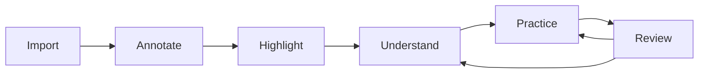

# Coilora Product Overview and Requirements

## 1. Product vision

Medical students receive more information than they can effectively organize, understand, and retain. Their PDF notes, handwritten annotations, lecture transcripts, flashcards, and review schedules are usually split across several applications. Coilora turns these disconnected actions into one controlled learning loop.

The product begins as a responsive web application so the learning workflow can be validated affordably across Windows, macOS, iPadOS, Android, and mobile browsers. Native tablet applications follow after validation. Coilora is web-first, not web-only, and tablet-focused without being iPad-exclusive.

### Vision statement

> Give every medical and allied-health student a calm, trustworthy workspace that converts information overload into retained knowledge without taking control away from the learner.

### Working brand

- **Name:** Coilora
- **Tagline:** *Shed the overload. Keep what matters.*
- **Brand themes:** focus, continuity, medicine, memory, calm intelligence, student agency
- **Selected emblem:** a calm serpent forming the letter C around an open book, using dark blue and mint
- **Avoid:** snake imagery that feels dangerous, pharmaceutical, occult, or like a clinical-care product

The authoritative asset list, startup motion, platform behavior, and accessibility requirements are documented in [Brand Assets and Startup Animation](./11_BRAND_AND_STARTUP_ANIMATION.md).

## 2. Inspiration without imitation

Coilora is inspired by two product models:

- **Goodnotes:** natural handwriting, direct PDF markup, visual notebook organization, offline access, and study sets.
- **NotebookLM:** source collections, source-grounded questions, clear citations, and source-derived learning artifacts.

Coilora should learn from their interaction principles without copying protected branding, illustrations, layouts, icons, wording, or proprietary implementations. Its information architecture should be organized around the six-stage medical-study workflow rather than recreating either competitor screen-for-screen.

The detailed feature mapping is documented in [Feature Inspiration and Differentiation](./FEATURE_INSPIRATION_AND_DIFFERENTIATION.md). In summary:

- Goodnotes primarily inspires the document notebook, PDF annotation, handwriting, organization, and spaced-practice experience.
- NotebookLM primarily inspires source collections, selected-source grounding, cited AI answers, and generated study artifacts.
- Both products influence AI-assisted study and cross-platform access.
- Coilora differentiates through non-destructive AI highlight proposals, citation continuity from source to review, medical-specific image occlusion and study categories, evidence-based weak topics, exam-aware FSRS scheduling, and a continuous Import → Annotate → Highlight → Understand → Practice → Review loop.

## 3. Target users

### Primary persona: lecture-driven medical learner

- Studies primarily from lecture PDFs and textbooks.
- Uses a laptop, desktop, tablet, or phone to manage study material.
- May use a stylus tablet, but an iPad is not required for the web MVP.
- Highlights and adds notes during lectures or independent study.
- Has limited time to turn material into flashcards.
- Wants explanations but needs to know exactly where each answer came from.
- Reviews for frequent quizzes, practicals, shifting exams, and board-style assessments.

### Secondary personas

- Medical-technology student working with laboratory diagrams, tables, microscopy, and reference ranges.
- Nursing or allied-health student studying procedural, pharmacological, and anatomy material.
- Pre-medical student learning foundational biology, chemistry, anatomy, and physiology.

### Future personas, outside MVP

- Educators distributing material and reviewing class performance.
- Study groups sharing selected notebooks.
- Institutions managing privacy, retention and AI policies.

## 4. Jobs to be done

1. When a lecture begins, I want to import its material quickly so I can write without reorganizing files first.
2. When I annotate, I want the ink to appear immediately and stay exactly where I placed it at every zoom level.
3. When I face a dense page, I want help identifying likely high-yield material without losing editorial control.
4. When I do not understand something, I want a clear explanation supported by the material my instructor actually gave me.
5. When I find an important concept or image, I want to turn it into effective practice with minimal retyping.
6. When I have limited study time, I want to know what to review today and why it is being prioritized.

## 5. Student workflow

### 5.1 Import study materials

Upload lecture PDFs, scanned notes, images, and existing transcriptions.

**Requirements**

- Import through the browser's file picker and supported device file providers.
- Import one or multiple PDFs and images.
- Paste or upload plain-text and Markdown transcriptions.
- Keep the original uploaded file unchanged.
- Display upload, validation, OCR and indexing progress separately.
- Allow an imported document to be opened and annotated before AI indexing finishes.
- Allow retry after interrupted uploads.
- Identify encrypted, corrupted or unsupported documents clearly.
- Preserve a user-supplied title while retaining the original filename as metadata.

**Later**

- Scan physical notes with a supported phone or tablet camera.
- Record or upload lecture audio and create a timestamped transcript.
- Import PowerPoint, Word, ePub, web pages and YouTube transcripts.

### 5.2 Web document reader and annotations

Read, highlight, add typed notes, and create image-occlusion masks over imported material.

**Required web MVP tools**

- Text selection and manual highlighting.
- Typed notes anchored to a page or source passage.
- Basic editable image-occlusion masks.
- Undo and redo for the active editing session.
- Page thumbnails and page jump.
- Search within text-based PDFs.
- Zoom, fit-to-width, and continuous-scroll modes.
- Citation navigation to the correct page and source region.

**Behavioral requirements**

- Durable geometry uses PDF page coordinates or normalized page coordinates, not browser pixels.
- Highlights remain aligned during zoom and responsive layout changes.
- Pending edits survive an ordinary page refresh where browser capabilities allow it.
- AI suggestions occupy a visually distinct, non-destructive layer.
- Export may flatten accepted annotations into a new PDF, but must not overwrite the source.

**Native tablet release**

The later iPad and Android tablet applications add pressure-aware ink, stylus palm rejection, pen and eraser tools, lasso selection, movable handwriting, low-latency local saving, and robust offline synchronization. These requirements remain strategically important but do not block validation of the web learning loop.

### 5.3 AI smart highlighting

Suggest important passages with page citations. Students can accept, reject, or adjust every suggestion.

**Requirements**

- Suggestions are generated per page, selection, section or entire notebook.
- Each suggestion contains the source span, page, category, reason and confidence.
- Categories initially include definition, mechanism, diagnostic feature, laboratory value, comparison, exception, adverse effect, process step and likely exam point.
- Suggested highlights appear in preview mode and do not alter the student's document.
- Students can accept, reject, edit the selection range, change color, or convert a suggestion into a card.
- The app remembers accepted and rejected suggestions to avoid repeatedly proposing the same span.
- The product must not claim that “high-yield” means guaranteed to appear on an exam.

### 5.4 Source-grounded AI assistant

Ask questions and receive explanations based only on uploaded materials, with links to the original pages.

**Requirements**

- Students can select which course, notebook or sources are active.
- Answers must be grounded in retrieved source passages.
- Every factual claim must link to one or more page or transcript-timestamp citations.
- Tapping a citation opens the source at the referenced location.
- If the evidence is absent or conflicting, the assistant must say so.
- A visible setting distinguishes strict-source mode from future optional external-reference mode. MVP ships only strict-source mode.
- Students can ask for summaries, comparisons, explanations at different levels, mnemonics and practice questions.
- Chat history is stored per notebook and can be deleted.
- An answer can be converted into a note or draft study item, preserving its citations.

### 5.5 Automatic study-material generation

Turn selected content into flashcards, quizzes, cloze questions, and image-occlusion cards.

**Requirements**

- Generate from a selected annotation, source passage, page, document section or notebook.
- Card types: basic Q/A, bidirectional, cloze, multiple-choice and image occlusion.
- Every generated item starts as a draft unless the student explicitly enables automatic activation.
- The student can edit the prompt, answer, distractors, explanation, tags and source.
- Multiple-choice distractors must be plausible but unambiguously wrong according to the selected sources.
- Each item preserves source-span identifiers and page citations.
- Image occlusion allows drawing one or multiple masks over a page crop or imported image.
- Duplicate or near-duplicate detection warns before adding cards.
- Generated cards must avoid giant answers, trivia without learning value, and multi-fact prompts unless intentionally configured.

### 5.6 Spaced-repetition review

Create a daily review queue that prioritizes missed questions and difficult topics.

**Requirements**

- Use FSRS as the scheduler foundation.
- Record review time, grade, response duration, due date and scheduling state.
- Initial grades: Again, Hard, Good and Easy.
- Display due reviews, new cards, estimated session duration and overdue count.
- Allow an exam date and optional daily time budget.
- Exam-date planning may reorder or introduce cards, but must never silently erase overdue work.
- Weak topics are calculated from review evidence such as lapses and low recall, not from AI opinion alone.
- Reviews intentionally downloaded for offline use must synchronize idempotently later.

## 6. Complete experience

The loop is intentionally continuous. Missed reviews should link back to explanations and source pages, while accepted highlights should offer immediate creation of practice items.

## 7. Information architecture

### Web application navigation

- **Library:** courses, notebooks, recent files, import, processing status, and search.
- **Reader:** document tabs, page thumbnails, PDF canvas, annotations, and AI suggestions.
- **Ask:** notebook-scoped assistant with selected sources and citations.
- **Study:** drafts, active cards, quizzes, and image occlusion.
- **Review:** today's queue, exam plans, history, and weak topics.
- **Settings:** account, storage, privacy, export, deletion, subscription, and help.

Desktop layouts use a persistent sidebar where space allows. Tablet and phone browsers use responsive navigation. The PDF remains the dominant surface in the reader. Keyboard access, touch targets, screen readers, reduced motion, sufficient contrast, and responsive type are required.

### Later native applications

- **iPad:** complete stylus notebook plus all shared study features.
- **Android tablet:** stylus notebook after demand and device requirements are validated.
- **Phones:** review, quick import, scanning, recording, and reminders.

## 8. Functional status models

### Account status

`pending_verification`, `active`, `suspended`, `deletion_requested`, `deleted`

### Document status

`awaiting_upload`, `uploaded`, `validating`, `quarantined`, `extracting`, `ocr_required`, `indexing`, `ready`, `failed`

### AI suggestion status

`suggested`, `accepted`, `edited`, `rejected`, `superseded`

### Study item status

`draft`, `active`, `suspended`, `archived`

### Synchronization status

`local_only`, `pending`, `syncing`, `synced`, `conflict`, `failed`

## 9. Non-functional product requirements

### Performance

- The PDF reader must remain responsive while rendering representative lecture documents.
- Page rendering must be lazy and memory-bounded.
- Opening cached metadata and downloaded review material should tolerate temporary network loss.
- Large documents must use lazy page loading and bounded memory.
- Chat must stream partial output after retrieval rather than holding the interface until completion.
- Background processing must expose a resumable state rather than an indefinite spinner.

### Reliability

- Local annotations are saved before attempting cloud synchronization.
- Upload and mutation operations use idempotency keys.
- Original documents are immutable and versioned rather than overwritten.
- Deletions enter a recoverable grace state before permanent purge, except when immediate deletion is legally or explicitly required.

### Accessibility

- VoiceOver labels for tools, sources and review controls.
- Dynamic Type outside the PDF canvas.
- Sufficient color contrast and non-color status indicators.
- Keyboard navigation and shortcuts for common web actions.
- Reduced-motion support.
- Adjustable answer font size during review.

### Trust

- Clear separation between student-created marks and AI suggestions.
- Citation required for factual AI output.
- Visible “not found in sources” state.
- AI-generated study items are editable and reportable.
- The app avoids diagnostic, treatment or patient-specific recommendations.

## 10. Success measures

### Activation

- Percentage of new users who import a document and complete processing.
- Time from signup to the first cited answer or activated study item.
- Percentage who ask a cited question or create one study item during the first week.

### Learning-loop adoption

- Imported documents with at least one annotation.
- Accepted versus rejected highlight suggestions.
- Citation-open rate from AI answers.
- Draft-to-active study-item conversion.
- Weekly review completion rate.
- Return from a missed card to its source page.

### Quality guardrails

- Saved-annotation loss incidents: target zero.
- Cross-user data exposure incidents: target zero.
- Answers without valid citations: target zero in strict-source mode.
- Citation accuracy based on sampled human evaluation.
- AI-generated question defect and deletion rate.
- Crash-free sessions and Pencil editor frame-time distribution.

Avoid vanity metrics such as total AI messages without measuring whether students use the sources and complete reviews.

## 11. Monetization hypothesis

Do not finalize pricing before measuring AI and storage cost. A reasonable initial structure is:

- **Free:** limited notebooks/storage, core annotation, small monthly AI allowance, basic reviews.
- **Student:** larger storage, full AI workflow, OCR/transcription allowance, unlimited study sets within fair-use limits.
- **Future institution:** managed accounts, policy controls, class distribution and analytics.

Validate engagement and infrastructure cost before charging. If web subscriptions are introduced, keep one entitlement model in the backend. Later App Store and Play Store purchases must reconcile into that same entitlement model rather than creating unrelated sources of truth.

## 12. Product decisions still open

- Supported browser and responsive-device matrix.
- Exact private-beta participant and success thresholds.
- Whether camera scanning is browser MVP, mobile companion, or the first post-MVP feature.
- Whether lecture audio recording is permitted at launch or only transcript import.
- Which PDF.js, Konva, and pdf-lib limitations must be solved in Coilora while keeping the open-source policy.
- Exact browser cache and upload quotas.
- Whether annotations are kept solely in Coilora's model or also exported as standard PDF annotation objects.
- Minimum supported iPadOS and Android versions for later native clients.
- Launch geography and age policy.
- Free-tier limits and subscription pricing.

## References

- [Goodnotes features](https://www.goodnotes.com/features/)
- [Goodnotes PDF annotation](https://www.goodnotes.com/features/pdf-annotation)
- [NotebookLM overview](https://support.google.com/notebooklm/answer/16164461)
- [NotebookLM source types](https://support.google.com/notebooklm/answer/16215270)
- [NotebookLM flashcards and quizzes](https://support.google.com/notebooklm/answer/16958963)
- [Apple designing for iPadOS](https://developer.apple.com/design/human-interface-guidelines/designing-for-ipados)
- [Apple Pencil and Scribble](https://developer.apple.com/design/human-interface-guidelines/apple-pencil-and-scribble)
- [Anki FSRS guidance](https://docs.ankiweb.net/deck-options.html#fsrs)
