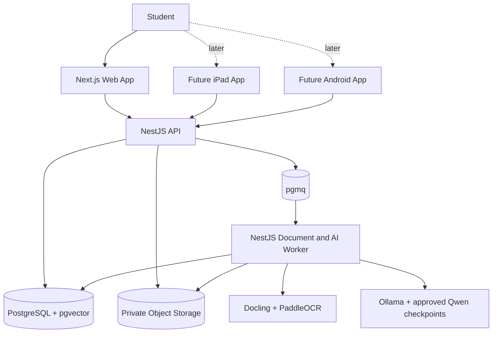
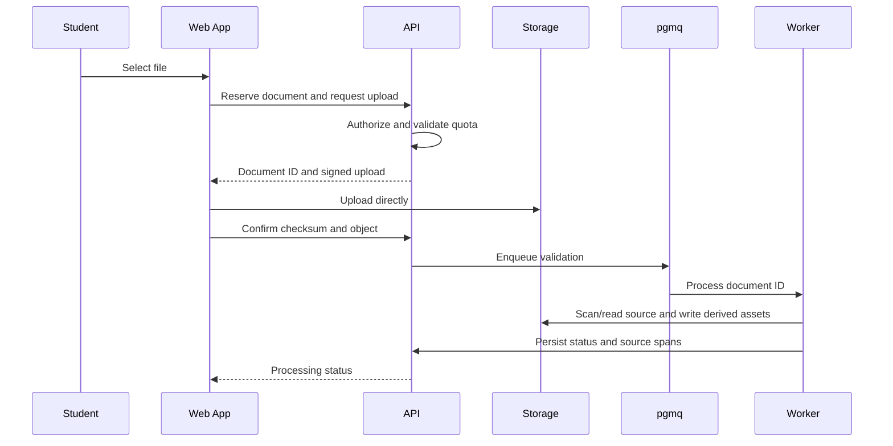
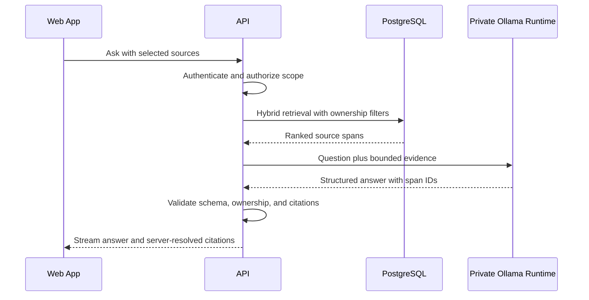

# Coilora System Architecture

## 1. Architecture decision

Coilora begins as a self-hostable web application backed by one platform API and one worker. Native applications are added only after validation and use the same accounts, files, citations, study items, and review history.

The required application stack contains no paid or proprietary third-party API. Open-source software removes API licence fees, but public hosting and model compute still cost money.

## 2. System context



All runtime units can run locally through containers. A public deployment runs the same boundaries on privately controlled infrastructure.

## 3. Initial deployment units

### Web application

Responsibilities:

- Public pages and account entry.
- Library and notebook interface.
- PDF rendering and editable annotation overlay.
- AI suggestion and assistant interface.
- Study-item editing and review.
- Settings, export, and deletion requests.

The browser receives short-lived user/session credentials only. It never receives service-role database credentials, unrestricted storage credentials, or direct access to model runtimes.

### API application

One NestJS modular monolith owns:

- Authentication verification.
- Authorization and ownership checks.
- Business operations and state transitions.
- Signed upload creation.
- Authorized retrieval.
- Assistant streaming.
- Study and review scheduling.
- Privacy operations.
- Rate and resource quotas.

### Worker

The worker consumes pgmq jobs for:

- File validation, ClamAV scanning, and sanitization.
- Docling extraction and page rendering.
- PaddleOCR fallback.
- Qwen embedding generation.
- Qwen highlight, answer, and study-item generation through Ollama.
- Future faster-whisper transcription.
- Exports and deletion.

Jobs carry identifiers, not complete documents. Every job is idempotent, retryable, resource-bounded, observable, and able to reach a dead-letter state.

### Data platform

Use self-hostable Supabase components around PostgreSQL:

- PostgreSQL as the canonical database.
- Auth as the identity authority.
- Private object storage.
- Row Level Security.
- pgvector for semantic search.
- pgmq for durable jobs.

A managed free Supabase project may accelerate development, but the application must remain runnable with the open-source self-hosted stack.

### Local intelligence services

- Docling performs document structure extraction.
- PaddleOCR processes only pages that fail native extraction checks.
- Ollama serves exact approved Qwen checkpoints privately.
- vLLM may replace Ollama for measured production throughput needs without changing Coilora's internal ports.

## 4. Repository structure

```text
coilora/
  apps/
    web/                   Next.js application
    api/                   NestJS HTTP application, added in Phase 1
    worker/                NestJS worker, added when background jobs begin
  packages/
    contracts/             OpenAPI and generated TypeScript types, when shared
    ui/                    Shared components and design tokens, when shared
    study-engine/          ts-fsrs rules and review policies, when implemented
    ai-contracts/          Prompts, Zod schemas, and model ports, when implemented
    test-fixtures/         Synthetic source and citation fixtures, when needed
  services/
    document-intelligence/ Docling and PaddleOCR wrapper, added in Phase 2
    model-runtime/         Ollama configuration and model manifest, added in Phase 3
  supabase/
    config.toml
    migrations/
  deploy/
    compose/               Added with the self-hosted development stack
    caddy/                 Added when an ingress proxy is required
    backup/                Added with production backup automation
  docs/
    coilora/
```

Only `apps/web`, `supabase`, and the documentation exist during the current foundation
phase. API, worker, shared-package, service, deployment, and native-client directories are
created only when their implementation begins.

## 5. Request flows

### Document upload



### Grounded question



## 6. API boundaries

- REST/JSON for resources and synchronization.
- Server-Sent Events for assistant and job progress.
- Direct signed/resumable uploads for large files.
- No external-provider webhooks in the baseline.
- No WebSockets until an approved feature requires bidirectional realtime communication.

OpenAPI is the contract authority. Web and future native clients use generated types where practical.

## 7. Document and annotation architecture

```text
Original PDF
  + student annotation layer
  + accepted AI-highlight layer
  + temporary AI-suggestion layer
  + study-item source links
```

PDF.js renders the source; Konva renders editable web annotations; pdf-lib creates optional exports. Coordinates use PDF-page or normalized page space so the same data can later render on iPad and Android.

## 8. Backend modules

```text
identity
profiles
courses
notebooks
documents
annotations
uploads
processing
retrieval
assistant
study-items
reviews
privacy
notifications
audit
admin
```

These are module boundaries inside one application, not microservices. Extract a service only after an independent scale, security, availability, or ownership requirement is measured.

## 9. Environments and deployment

- **Local:** synthetic fixtures and local containers.
- **Development:** shared integration environment without production documents.
- **Staging:** production-like private-beta verification.
- **Production:** real student data.

Each environment has separate databases, buckets, auth secrets, model configuration, and encryption material. Production files never enter lower environments.

Local/private testing may run on the developer's computer. Public production uses a Linux server with Caddy HTTPS, containers, encrypted backups, and sufficient CPU/RAM/disk. A GPU is introduced only after a benchmark proves it is required.

## 10. Reliability design

- Original files are immutable and checksummed.
- Mutations and job enqueueing use idempotency keys.
- Jobs record attempts, resource use, and terminal reasons.
- AI output records exact model and prompt revisions.
- Review events are append-only and deduplicated.
- Database changes are backward compatible during deployment.
- Database restoration and object recovery are tested.
- Model or OCR failure cannot corrupt user-authored annotations.

## 11. Future native architecture

The later iPad application may use SwiftUI, PDFKit, and PencilKit; the later Android application may use Kotlin/Compose or React Native. Platform SDKs are not open source, so they are recorded as platform exceptions. They consume Coilora's portable annotation, citation, study-item, and review formats rather than becoming the canonical store.

## 12. Architecture decisions

- ADR-001: Web-first validation using Next.js.
- ADR-002: NestJS modular monolith before microservices.
- ADR-003: PostgreSQL-centered, self-hostable Supabase data platform.
- ADR-004: Immutable originals and independent annotation layers.
- ADR-005: Strict-source retrieval with mandatory provenance.
- ADR-006: ts-fsrs scheduling.
- ADR-007: Docling and PaddleOCR for local document intelligence.
- ADR-008: Ollama plus exact Apache-2.0 Qwen checkpoints for initial local AI.
- ADR-009: pgvector and pgmq instead of separate vector and queue services.
- ADR-010: Native clients only after the web validation gate.
- ADR-011: No paid/proprietary third-party API without an explicit policy exception.

## References

- [Next.js](https://nextjs.org/docs)
- [NestJS](https://docs.nestjs.com/)
- [Supabase self-hosting](https://supabase.com/docs/guides/self-hosting)
- [pgvector](https://github.com/pgvector/pgvector)
- [pgmq](https://github.com/pgmq/pgmq)
- [PDF.js](https://github.com/mozilla/pdf.js/)
- [Docling](https://docling.ai/)
- [PaddleOCR](https://github.com/PaddlePaddle/PaddleOCR)
- [Ollama](https://github.com/ollama/ollama)
- [OpenAPI Specification](https://spec.openapis.org/oas/latest.html)
