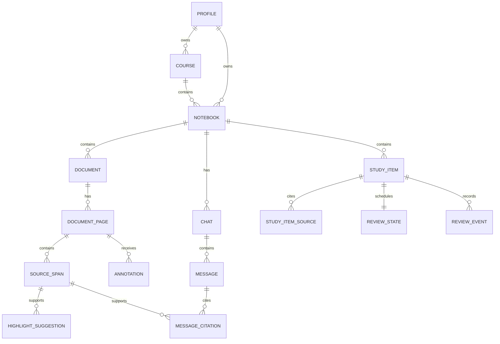

# Coilora Database and Storage

## 1. Storage principle

Coilora does not use one storage system for every type of information.

```text
PostgreSQL       Structured product data and permissions
Object storage   PDFs, images, audio, previews, and exports
pgvector         Embeddings attached to cited source spans
Browser storage  Temporary cache and pending web edits
Native SQLite    Future offline tablet data and sync outbox
```

## 2. Canonical ownership

| Data | Canonical location |
|---|---|
| Accounts, notebooks, metadata | PostgreSQL |
| Highlights and typed annotations | PostgreSQL |
| Study items and review history | PostgreSQL |
| PDF, image, and audio binaries | Private object storage |
| Extracted source spans and citations | PostgreSQL |
| Embeddings | PostgreSQL with pgvector |
| Temporary browser state | IndexedDB |
| Future native offline state | SQLite/SwiftData |

Original uploads are immutable. A replacement creates a new document version rather than overwriting the prior object.

## 3. Core relational entities

```text
profiles
devices
courses
notebooks
documents
document_versions
document_pages
source_spans
annotations
annotation_operations
highlight_suggestions
chats
messages
message_citations
study_items
study_item_sources
review_states
review_events
jobs
entitlements
audit_events
```

All user-owned records include an owner identifier directly or inherit ownership through a foreign-key path that database policies can enforce safely.

## 4. Important entity relationships



## 5. Source spans and citations

Every searchable passage stores:

- `document_id`
- `document_version_id`
- `page_id` or transcript time range
- normalized text
- bounding box or ordered text positions
- parser and OCR version
- language
- full-text search vector
- semantic embedding
- checksum

AI output cites stable source-span identifiers, not only a page number written into generated prose. This allows Coilora to validate and render citations consistently.

## 6. Annotation model

Annotations are separate from the original PDF.

Common fields:

- ID, owner, document version, and page.
- Type: highlight, text note, ink stroke, image, shape, or occlusion mask.
- Geometry in normalized or PDF page coordinates.
- Style data.
- Content or a reference to a large binary representation.
- Revision and timestamps.
- Creation source: student, accepted AI suggestion, or import.
- Deleted timestamp for recoverable synchronization.

Large native drawing representations belong in object storage if they become too large for ordinary rows. The database keeps their identity, revision, geometry, ownership, and object reference.

## 7. Object storage layout

Use private buckets and immutable paths:

```text
users/{userId}/documents/{documentId}/source/{versionId}.pdf
users/{userId}/documents/{documentId}/pages/{pageId}/preview.webp
users/{userId}/documents/{documentId}/ocr/{versionId}.json
users/{userId}/annotations/{annotationId}/{revisionId}.bin
users/{userId}/exports/{exportId}.zip
```

Clients receive short-lived signed URLs or narrowly authorized upload sessions. Object paths must never be treated as authorization by themselves.

## 8. Retrieval indexes

Use hybrid retrieval:

1. PostgreSQL full-text search for exact medical terms, abbreviations, drug names, and laboratory values.
2. pgvector similarity for conceptual matches.
3. Metadata filters for owner, course, notebook, document, version, and processing status.
4. A rank-fusion step.
5. Optional local reranking only when evaluation proves it improves citation quality enough to justify its latency and compute.

Authorization filters run before retrieved text reaches the private model runtime.

## 9. Browser cache

The web MVP may cache selected data in IndexedDB, but it must:

- Avoid placing authentication secrets in application-readable long-term storage when secure cookies can be used.
- Expire document caches.
- Clearly handle shared or public computers.
- Never treat cached authorization decisions as current authority.
- Queue mutations with stable idempotency keys.
- Remove local data during sign-out when appropriate.

## 10. Future native offline database

The native tablet application should use a local database and an outbox:

1. Apply edits locally.
2. Commit locally before confirming save.
3. Append a synchronization operation.
4. Upload when connected.
5. Acknowledge only after the server accepts it.

Native offline sync will use a Coilora-owned outbox, idempotent API operations, and local SQLite. Introduce a separate synchronization dependency only if it is verified as open source and the custom approach fails measured conflict or reliability requirements.

## 11. Backup and deletion

- Database backups and object-storage backup policies are separate concerns.
- Test restoration, not only backup creation.
- Soft deletion may provide a short recovery period.
- Privacy deletion jobs must eventually purge database records, stored objects, derived previews, embeddings, local model caches that contain user content, and backups according to the documented retention schedule.
- Audit completion without retaining deleted study content.

## 12. Database security requirements

- Enable Row Level Security on every exposed user-data table.
- Deny access by default.
- Test cross-user access using automated authorization tests.
- Keep service-role credentials on trusted servers only.
- Use migrations for schema and policy changes.
- Apply constraints for ownership, uniqueness, valid state transitions, and append-only review events.
- Do not expose unrestricted vector-search functions to clients.

## References

- [Supabase database](https://supabase.com/docs/guides/database/overview)
- [Supabase Row Level Security](https://supabase.com/docs/guides/database/postgres/row-level-security)
- [Supabase storage access control](https://supabase.com/docs/guides/storage/security/access-control)
- [Supabase pgvector](https://supabase.com/docs/guides/database/extensions/pgvector)
- [PostgreSQL full-text search](https://www.postgresql.org/docs/current/textsearch.html)


