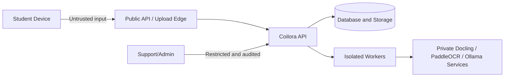

# Coilora Security, Authentication, and Privacy

## 1. Security objective

Students may upload copyrighted course material, personal annotations, education records and content that accidentally contains health information. Coilora must protect confidentiality, integrity, availability and user control from the first prototype onward.

This document is an engineering baseline, not legal advice. Launch markets, institutional use and the handling of patient-related information require review by qualified privacy and legal professionals.

## 2. Data classification

| Class | Examples | Default handling |
|---|---|---|
| Public | Marketing pages, public help | Normal web controls |
| Internal | Feature flags, non-sensitive metrics | Staff need-to-know |
| Confidential | Course files, annotations, chats, cards, email | Encryption, strict ownership, no content logging |
| Highly restricted | Auth tokens, service-role credentials, private model endpoints, deletion exports, possible patient identifiers | Key management, shortest retention, audited access, never client-exposed |

The MVP must explicitly prohibit uploading identifiable patient records or using Coilora for clinical care. Provide an in-product reminder during onboarding/import and a reporting/removal process. If patient data becomes an intended use case, stop and conduct a dedicated regulatory, contractual and security program before enabling it.

## 3. Trust boundaries

Every boundary requires authentication where applicable, authorization, validation, timeouts, least privilege and privacy-aware logging.

## 4. Authentication

### MVP methods

- Verified email/password or email magic link on web.
- No social-login dependency in the web MVP.
- Platform sign-in is deferred and treated as a documented native-platform exception.
- Native Sign in with Apple when the iPad application begins.

Supabase Auth is the identity authority and issues JWTs. NestJS verifies tokens using the supported public-key/JWKS mechanism or official library. Do not implement cryptographic verification manually.

### Session controls

- Access tokens are short lived.
- Web sessions use Secure, HttpOnly and appropriate SameSite cookies when cookie-based.
- Native refresh tokens are stored in Keychain or Android secure storage, never plain preferences.
- Revoke sessions on password/security events, account suspension or deletion.
- Display active devices and allow sign-out from all devices after MVP.
- Require recent reauthentication for export, account deletion and sensitive account changes.

When native development begins, Apple Sign-In should use a nonce and server-side token verification. Capture the user's name on first native authorization if needed because it may not be returned later.

## 5. Authorization

### Defense in depth

1. API route requires a valid principal.
2. Application use case checks account status and permission.
3. Repository query includes `owner_id` or membership predicate.
4. PostgreSQL grants and RLS protect exposed tables.
5. Storage policy restricts object paths and operations.

Every object identifier is untrusted. Test attempts by User A to access User B's:

- course
- notebook
- document metadata
- source file and page preview
- annotation and sync cursor
- chat/message/citation
- study item/review history
- export and processing job

The Supabase `service_role` or secret key bypasses RLS and must exist only in trusted server configuration. Client applications receive publishable credentials only.

### Administrative access

- Support UI shows account state, quotas, job errors and redacted filenames only when necessary.
- Normal support cannot download student documents or read chats.
- Privileged content access, if ever introduced, requires a separate permission, explicit reason, user/legal basis, short duration and audit trail.
- Staff production access uses individual identities and MFA; no shared administrator accounts.

## 6. Storage and cryptography

- TLS for every network path.
- Private buckets for all student content.
- Short-lived signed URLs after authorization; URLs are bearer secrets and should not be logged.
- Encryption at rest on the self-hosted database and object-storage volumes; consider application-level encryption for especially sensitive exports.
- Store service credentials and model configuration through restricted environment injection or an approved open-source secret store, never source control.
- Rotate compromised secrets and maintain a key inventory.
- Use Keychain or Android secure storage for future native tokens and cryptographic keys.
- Do not invent custom cryptographic algorithms; use platform libraries such as CryptoKit when application-level operations are needed.
- For native clients, use platform data-protection settings appropriate to offline files and background transfers.

## 7. Secure file processing

File import is a hostile-input boundary.

- Allowlist supported types and inspect magic bytes.
- Enforce maximum compressed and expanded size, page count, image dimensions, audio duration and processing time.
- Use random server-generated object paths.
- Prevent path traversal and filename-based execution.
- Scan malware before indexing.
- Run parsers with restricted filesystem/network access and memory/CPU limits.
- Reject or strip PDF JavaScript, launch actions, executable attachments and unsupported embedded content.
- Do not render untrusted HTML from documents.
- Sanitize generated thumbnails and previews.
- Quarantine failures and avoid revealing parser internals to users.
- Keep parser dependencies patched and regression-test malicious fixtures.

## 8. API and application controls

- Validate every request with explicit schemas.
- Parameterize SQL and avoid user-controlled query fragments.
- Set body-size limits before parsing.
- Apply rate limits by IP, user and feature.
- Use idempotency keys for retryable state changes.
- Verify webhook signatures and timestamps; deduplicate event IDs.
- Bound timeouts and retries; use exponential backoff with jitter.
- Apply a restrictive CORS allowlist.
- Add web CSRF protection when using cookies.
- Add a Content Security Policy and sanitize model-generated markdown.
- Prevent open redirects and unsafe custom URL/deep-link handling.
- Remove secrets and document contents from errors.

## 9. AI-specific controls

- Send only the minimum source passages needed for the request.
- Keep model, OCR, and parsing services private; restrict their storage, network access, logs, and retention.
- Treat source content as data, never instructions.
- Restrict tools and external actions; strict-source chat does not browse the web.
- Apply authorization before retrieval.
- Validate structured outputs and citation IDs server-side.
- Moderate abuse where appropriate without suppressing legitimate educational medical content.
- Never claim a generated answer is medically verified merely because it has a citation.
- Provide feedback/report controls and retain evaluation evidence without copying unnecessary private content.

## 10. Privacy program

### Privacy by design

- Collect only data necessary for the feature.
- Explain why each permission is requested at the moment it is needed.
- Do not request Contacts, HealthKit, location or microphone unless a shipped feature truly needs it.
- Camera permission is required only for scanning.
- Microphone permission is required only for recording, not transcript upload.
- Separate required processing from optional analytics/marketing consent.
- Use privacy-respecting analytics with stable pseudonymous IDs.
- Avoid third-party advertising SDKs in a student study product.

### User rights and controls

- View and correct profile information.
- Export notebooks, original files, annotations, cards and review history in usable formats.
- Delete individual documents and chats.
- Initiate complete account deletion in the web app and every future native app.
- Explain deletion grace period, subscription handling and legally retained records.
- Allow cancellation of a pending deletion during the stated grace period.

Future store-distributed apps must implement the account-deletion and privacy-disclosure requirements of their respective stores.

### Retention proposal

| Data | Suggested policy |
|---|---|
| Active content | Until user deletes or account closes |
| Deleted document | Soft-delete grace period, then purge objects and derived indexes |
| Chat | Until user deletes or account closes |
| Raw audio | User-controlled; consider deleting after confirmed transcription by default |
| Account export archive | Short expiry such as 7 days |
| Operational logs | 30–90 days, content-free |
| Security audit events | Longer justified period, metadata only |
| Backups | Documented rolling retention and eventual purge behavior |

Exact periods require legal and operational approval. Deletion workflows must account for backups, derived artifacts, worker caches, and model traces—not only primary database rows.

## 11. Philippines launch considerations

The Philippine Data Privacy Act applies to processing personal information and defines education and health information as sensitive personal information. The product operator may be a personal information controller and remains accountable for data handled by processors. Before launch:

- Identify the lawful basis and purpose for each processing activity.
- Publish a clear privacy notice with controller identity, purposes, recipients, retention and rights.
- Inventory all infrastructure operators, subprocessors, and international transfers.
- Execute appropriate data-processing terms with any hosting, email, domain, or backup operator used in production.
- Assign privacy accountability.
- Determine registration, data-protection-officer and data-processing-system obligations with Philippine counsel or the National Privacy Commission's current guidance.
- Maintain incident and breach-response procedures.

If launching outside the Philippines, perform a market-by-market review rather than assuming Philippine compliance is sufficient.

## 12. Future native store requirements

- These requirements do not block the private web MVP, but they must be completed before native distribution.
- Join the Apple Developer Program for iPad TestFlight and App Store distribution.
- Provide an accurate privacy policy URL and App Privacy disclosures.
- Include in-app account deletion.
- If third-party/social login is offered for the primary account, evaluate Apple's equivalent-login requirement; offering Sign in with Apple simplifies this.
- Use StoreKit/In-App Purchase for digital subscriptions where App Store rules require it.
- Provide App Review with a functioning demo account or full demo mode and sample documents.
- Explain AI, document import, subscriptions and hardware-dependent Pencil behavior in review notes.
- Ensure the app has rights to bundled content, icons and marketing assets.
- Avoid copycat metadata or UI representation of Goodnotes or NotebookLM.
- Before Android release, complete Google Play data-safety, account-deletion, billing, and testing requirements.

Apple Developer Program membership is currently listed at USD 99 per membership year, with local-currency variation where available. Verify the price at enrollment.

## 13. Backups and recovery

- Enable automated encrypted daily backups before storing real student data.
- Schedule independent logical exports where appropriate.
- Define Recovery Point Objective and Recovery Time Objective.
- Test restore to a non-production environment at least quarterly once launched.
- Verify object-storage restoration/deletion separately from database restoration.
- Keep migration rollback procedures and application compatibility windows.
- A backup existing is not evidence that it can be restored; record restore tests.

## 14. Logging, monitoring and incident response

### Log

- Request ID, actor ID/pseudonym, endpoint, result, latency and error code.
- Job ID, document ID, state transition, attempt and duration.
- AI runtime/model version, input/output size, latency, resource use, and evaluation result.
- Security-relevant login, export, deletion and admin events.

### Do not log

- Access or refresh tokens.
- Signed URLs.
- API keys.
- Raw document text.
- Full chat prompts and answers by default.
- Audio or OCR contents.

### Alerts

- Cross-user authorization test failure.
- Elevated 401/403 or login abuse.
- Malware/quarantine spikes.
- Job backlog or repeated parser crashes.
- Citation validation failures.
- Unusual export/download volume.
- Budget/AI cost anomalies.
- Backup or restore failure.

### Incident preparation

- Named incident roles and contact path.
- Severity definitions.
- Credential-revocation runbooks.
- Hosting and infrastructure notification contacts.
- Evidence preservation with least access.
- User/regulator notification decision procedure.
- Post-incident corrective-action tracking.

## 15. Security verification checklist

- Threat model reviewed before public beta.
- Automated dependency and secret scanning.
- Static analysis for Swift and TypeScript.
- Authorization/RLS tests with multiple users.
- File-upload and parser fuzz/malicious fixture tests.
- Prompt-injection and citation-forgery tests.
- Mobile secure-storage and local-cache review.
- Web CSP, XSS, CSRF and session review.
- External penetration test before material scale or institutional sales.
- Account export/deletion rehearsal.
- Backup restore rehearsal.
- Open-source licence, platform SDK, and privacy-manifest review before App Store submission.

## References

- [Apple Keychain](https://developer.apple.com/documentation/security/using-the-keychain-to-manage-user-secrets)
- [Apple CryptoKit](https://developer.apple.com/documentation/cryptokit)
- [Apple App Review Guidelines](https://developer.apple.com/app-store/review/guidelines/)
- [Apple account-deletion guidance](https://developer.apple.com/support/offering-account-deletion-in-your-app/)
- [Apple App Privacy](https://developer.apple.com/help/app-store-connect/manage-app-information/manage-app-privacy/)
- [Supabase Row Level Security](https://supabase.com/docs/guides/database/postgres/row-level-security)
- [Supabase Storage access control](https://supabase.com/docs/guides/storage/security/access-control)
- [Supabase backups](https://supabase.com/docs/guides/platform/backups)
- [Philippine Data Privacy Act](https://privacy.gov.ph/data-privacy-act/)

