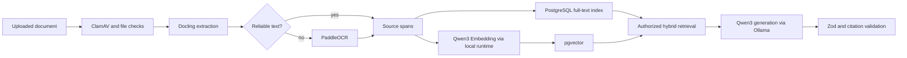

# Coilora Free and Open-Source Tools

## 1. Purpose

This is Coilora's authoritative third-party dependency and licence register. It replaces the earlier list of paid APIs and commercial SDKs.

The rule is strict:

- Required third-party software must have an established open-source licence and be self-hostable.
- A free trial is not considered free.
- A free hosted tier is optional convenience, not an architectural dependency.
- Open-source software may still require paid hardware, hosting, bandwidth, email delivery, backups, and operations.
- Every exact AI model checkpoint must be licence-reviewed separately from the runtime that loads it.

Future Apple and Android operating-system frameworks are unavoidable platform dependencies. They must be clearly marked and must not become Coilora's only data format.

## 2. Necessary for the first vertical slice

| Capability | Choice | Licence | Adopt when | Notes |
|---|---|---|---|---|
| Web framework | Next.js + React | MIT | Foundation | Web-first UI and routing |
| UI styling | Tailwind CSS | MIT | Foundation | Keep Coilora's own design system |
| Validation | Zod | MIT | Foundation | Validate API bodies and structured model output |
| PDF rendering | PDF.js | Apache-2.0 | Reader phase | Source rendering and selectable text |
| Annotation editing | Konva + react-konva | MIT | Reader phase | Highlights, notes, selection boxes, and occlusion masks |
| PDF export | pdf-lib | MIT | Export phase | Create a new flattened copy; never overwrite the original |
| API and worker | NestJS | MIT | Foundation | One modular monolith plus one worker process |
| Database | PostgreSQL | PostgreSQL licence | Foundation | Canonical relational data |
| Semantic search | pgvector | PostgreSQL-style licence | Assistant phase | Vectors remain beside authorized source records |
| Background jobs | pgmq | PostgreSQL licence | Import phase | Durable retryable jobs without another datastore |
| Auth and storage | Self-hostable Supabase components | Open-source repository; verify each image/package | Foundation | RLS, Auth, private object storage, and signed URLs |
| Document parser | Docling | MIT | Import phase | Local PDF/layout/table extraction and OCR routing |
| OCR engine | PaddleOCR | Apache-2.0 | Import phase | Run only on pages that need OCR |
| AI runtime | Ollama | MIT | Assistant phase | Local development and small private alpha |
| Generation model | Qwen3-8B exact checkpoint | Apache-2.0 | Assistant phase | Starting choice; acceptance depends on evaluation |
| Embedding model | Qwen3-Embedding-0.6B | Apache-2.0 | Assistant phase | Local embeddings for pgvector |
| Spaced repetition | ts-fsrs | MIT | Review phase | Scheduling and review state transitions |
| Upload scanning | ClamAV | GPL | Before external testers | Scan documents inside a restricted worker |

These are the only third-party systems required to prove:

**Import → Annotate → Highlight → Understand → Practice → Review**

## 3. Add only when the associated need appears

| Need | Tool | Licence | Adoption gate |
|---|---|---|---|
| Public-form bot resistance | ALTCHA | MIT | Add before public registration or anonymous forms |
| HTTPS reverse proxy | Caddy | Apache-2.0 | Add for public self-hosting |
| AI trace and evaluation UI | Langfuse OSS | MIT outside enterprise folders | Add when prompt/model experiments are difficult to compare in test reports |
| Standard telemetry export | OpenTelemetry | Apache-2.0 | Add when logs alone cannot explain cross-service latency |
| Privacy-conscious product analytics | Umami | MIT | Add during private beta; never record document content |
| Audio transcription | faster-whisper | MIT | Add only after audio upload is approved for the product scope |
| Higher-throughput model serving | vLLM | Apache-2.0 | Add only after measured Ollama concurrency or latency failure on Linux GPU infrastructure |

Deferring these tools is intentional. Open source still has installation, upgrade, backup, security, and monitoring costs.

## 4. Selected local intelligence pipeline



### Routing rules

- Do not OCR a digital PDF that already has reliable text.
- Do not send complete notebooks to the generation model; send only authorized retrieved spans.
- Do not accept page numbers written by the model. Resolve citations from server-owned span IDs.
- Do not let model output directly modify source documents or activate study items.
- Store the exact parser, OCR, embedding, model, and prompt versions used.

## 5. Model-selection rules

An open-source runtime does not make every downloadable model open source. Before adding or upgrading a model:

1. Pin the exact repository and revision/checksum.
2. Save the licence text with the dependency inventory.
3. Confirm commercial use and redistribution terms.
4. Reject research-only, non-commercial, custom restrictive, or missing licences.
5. Evaluate medical terminology, citation faithfulness, structured output, latency, and memory use.
6. Retain the previous model until migrations and evaluation fixtures pass.

The initial approved candidates are the exact Apache-2.0 Qwen checkpoints documented here. Similar names in another repository are not automatically approved.

## 6. PDF decision

Use one open-source web path:

```text
PDF.js       render and text selection
Konva        editable annotation overlay
pdf-lib      optional flattened export
```

Do not evaluate Nutrient, Apryse, or another commercial SDK under the current policy. If PDF.js cannot satisfy a requirement, either narrow that requirement, implement it in Coilora, or request an explicit policy exception before introducing a proprietary dependency.

For the later iPad application, PDFKit and PencilKit are free Apple SDK frameworks but not open source. Keep the canonical annotation JSON and original PDFs in Coilora's backend so students are not locked into Apple formats.

## 7. OCR and transcription decisions

### OCR

Docling plus PaddleOCR is the selected server pipeline. Build a benchmark using digital PDFs, scans, tables, equations, handwritten notes, histology labels, and Filipino/English material. Store word/block geometry where available.

If difficult handwriting remains inaccurate, report the limitation to the student and allow manual correction. Do not silently introduce a paid OCR API.

### Transcription

Audio is not required for the web MVP. When approved, use faster-whisper locally and retain timestamped editable segments. Speaker diarization is not promised in the first transcription release.

## 8. Security and privacy tools

- **ClamAV:** scan uploads before parsing.
- **ALTCHA:** protect public signup, password recovery, and abuse-sensitive forms.
- **Application limits:** enforce file, page, processing-time, AI-output, and per-account quotas in Coilora.
- **Isolation:** process untrusted documents and models in resource-limited containers without unrestricted network access.
- **Data minimization:** never put document text, filenames, answers, or chat content into analytics.

No open-source tool replaces secure configuration, updates, backups, access control, or incident response.

## 9. Observability without proprietary services

Begin with privacy-safe structured JSON logs, job-status tables, and health endpoints. Add tools only when needed:

- OpenTelemetry for traces and metrics export.
- Langfuse OSS for retrieval/model/prompt traces and evaluation datasets.
- Umami for product events such as successful imports and completed reviews.

Keep full private source text out of telemetry by default. Log opaque IDs, durations, sizes, versions, status codes, and evaluation scores.

## 10. Explicitly prohibited under the current policy

- Paid or proprietary AI APIs, including OpenAI, Anthropic, and Google-hosted generative APIs.
- Paid OCR/document services, including Mistral OCR, Mathpix, Google Document AI, Azure Document Intelligence, and Amazon Textract.
- Paid transcription services, including Deepgram and AssemblyAI.
- Commercial PDF SDKs, including Nutrient and Apryse.
- Proprietary bot services such as Cloudflare Turnstile.
- Trial-only dependencies or SDKs that watermark production output.
- Hosted vector databases when PostgreSQL plus pgvector is sufficient.
- AI models with unclear or non-commercial licences.

## 11. Cost truth

| Item | Licence/API cost | Real operational cost |
|---|---:|---|
| Local development | $0 | Developer computer, electricity, disk space, and time |
| Private home-network prototype | $0 software | Hardware availability and limited reliability |
| Public CPU deployment | $0 software | Server, domain, backups, storage, and bandwidth |
| Public GPU inference | $0 software | GPU server and substantially higher operations cost |
| Transactional email | Open-source server available | Domain reputation, delivery, maintenance, and possible relay fees |

“Free and open source” prevents vendor usage bills and lock-in; it does not guarantee a zero-dollar public service.

## 12. References and licence evidence

- [Supabase open-source repository](https://github.com/supabase/supabase)
- [PDF.js](https://github.com/mozilla/pdf.js/)
- [Konva](https://github.com/konvajs/konva)
- [pdf-lib](https://github.com/Hopding/pdf-lib)
- [pgvector](https://github.com/pgvector/pgvector)
- [pgmq licence](https://github.com/pgmq/pgmq/blob/main/LICENSE)
- [Docling](https://docling.ai/)
- [PaddleOCR](https://github.com/PaddlePaddle/PaddleOCR)
- [Ollama licence](https://github.com/ollama/ollama/blob/main/LICENSE)
- [Qwen3-8B model](https://huggingface.co/Qwen/Qwen3-8B)
- [Qwen3-Embedding-0.6B model](https://huggingface.co/Qwen/Qwen3-Embedding-0.6B)
- [vLLM licence](https://github.com/vllm-project/vllm/blob/main/LICENSE)
- [faster-whisper](https://github.com/SYSTRAN/faster-whisper)
- [ts-fsrs licence](https://github.com/open-spaced-repetition/ts-fsrs/blob/main/LICENSE)
- [ClamAV](https://www.clamav.net/about)
- [ALTCHA](https://github.com/altcha-org/altcha)
- [OpenTelemetry JavaScript licence](https://github.com/open-telemetry/opentelemetry-js/blob/main/LICENSE)
- [Langfuse open-source licensing](https://langfuse.com/handbook/chapters/open-source)
- [Umami licence](https://github.com/umami-software/umami/blob/master/LICENSE)
